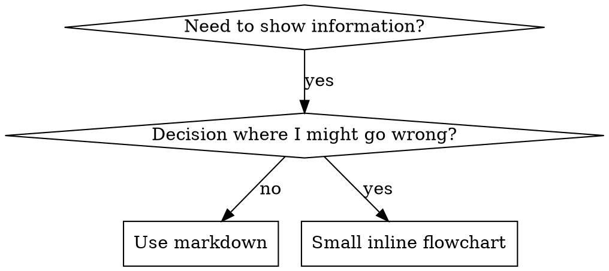

# Skill Format and File Layout

How a skill is typed, laid out on disk, structured inside SKILL.md, illustrated with flowcharts and code, and which format anti-patterns to avoid.

## Skill Types

### Technique
Concrete method with steps to follow (condition-based-waiting, root-cause-tracing)

### Pattern
Way of thinking about problems (flatten-with-flags, test-invariants)

### Reference
API docs, syntax guides, tool documentation (office docs)

### Workflow
Multi-step job that uses tools or MCP servers to get something done (send the weekly feedback, register an expense, file a meeting record). Pick its shape from Workflow Patterns below.

## Directory Structure


```
skills/
  skill-name/
    SKILL.md              # Main reference (required)
    supporting-file.*     # Only if needed
```

**Flat namespace** - all skills in one searchable namespace

**Separate files for:**
1. **Heavy reference** (100+ lines) - API docs, comprehensive syntax
2. **Reusable tools** - Scripts, utilities, templates

**Keep inline:**
- Principles and concepts
- Code patterns (< 50 lines)
- Everything else

## SKILL.md Structure

**Frontmatter (YAML):**
- Two required fields: `name` and `description` (see [agentskills.io/specification](https://agentskills.io/specification) for all supported fields)
- Max 1024 characters total
- `name`: Use letters, numbers, and hyphens only (no parentheses, special chars)
- `description`: Third-person, describes ONLY when to use and when NOT to use (NOT what it does)
  - Start with "Use when..." to focus on triggering conditions
  - Include specific symptoms, situations, and contexts
  - **NEVER summarize the skill's process or workflow** (see [description.md](description.md) for why)
  - Keep under 500 characters if possible

```markdown
---
name: Skill-Name-With-Hyphens
description: Use when [specific triggering conditions and symptoms]. Do NOT use for [near-miss requests].
---

# Skill Name

## Overview
What is this? Core principle in 1-2 sentences.

## When to Use
[Small inline flowchart IF decision non-obvious]

Bullet list with SYMPTOMS and use cases
When NOT to use

## Core Pattern (for techniques/patterns)
Before/after code comparison

## Quick Reference
Table or bullets for scanning common operations

## Implementation
Inline code for simple patterns
Link to file for heavy reference or reusable tools

## Common Mistakes
What goes wrong + fixes

## Real-World Impact (optional)
Concrete results
```


## Flowchart Usage



**Use flowcharts ONLY for:**
- Non-obvious decision points
- Process loops where you might stop too early
- "When to use A vs B" decisions

**Never use flowcharts for:**
- Reference material → Tables, lists
- Code examples → Markdown blocks
- Linear instructions → Numbered lists
- Labels without semantic meaning (step1, helper2)

See [graphviz-conventions.dot](../graphviz-conventions.dot) for graphviz style rules.

**Visualizing for your human partner:** Use `render-graphs.js` in the skill's root directory to render a skill's flowcharts to SVG:
```bash
node ./render-graphs.js ../some-skill           # Each diagram separately
node ./render-graphs.js ../some-skill --combine # All diagrams in one SVG
```

## Code Examples

**One excellent example beats many mediocre ones**

Choose most relevant language:
- Testing techniques → TypeScript/JavaScript
- System debugging → Shell/Python
- Data processing → Python

**Good example:**
- Complete and runnable
- Well-commented explaining WHY
- From real scenario
- Shows pattern clearly
- Ready to adapt (not generic template)

**Don't:**
- Implement in 5+ languages
- Create fill-in-the-blank templates
- Write contrived examples

You're good at porting - one great example is enough.

## File Organization

### Self-Contained Skill
```
defense-in-depth/
  SKILL.md    # Everything inline
```
When: All content fits, no heavy reference needed

### Skill with Reusable Tool
```
condition-based-waiting/
  SKILL.md    # Overview + patterns
  example.ts  # Working helpers to adapt
```
When: Tool is reusable code, not just narrative

### Skill with Heavy Reference
```
pptx/
  SKILL.md       # Overview + workflows
  pptxgenjs.md   # 600 lines API reference
  ooxml.md       # 500 lines XML structure
  scripts/       # Executable tools
```
When: Reference material too large for inline

### Pointing to Supporting Files

The agent reads SKILL.md whenever the skill loads; it opens a supporting file only when SKILL.md gives it a reason to. So cite every supporting file from SKILL.md together with the situation in which to open it:
- ✅ "Before writing queries, read `references/api-patterns.md`" / "When the input is a PDF, read `references/pdf.md`"
- ❌ "See references/ for more information" — the agent has no reason to open it, and whatever is there never reaches it

Keep the SKILL.md body under 500 lines; when it grows past that, move material into supporting files with those pointers. Keep references one level deep (SKILL.md → file, never file → file → file). Give any supporting file over 300 lines a table of contents.

Invoke bundled scripts through their interpreter in the prose (`bash scripts/tool.sh`, `node scripts/tool.js`), never by bare path: some harness plugin packagers strip executable bits, and a bare `scripts/tool.sh` fails there with `Permission denied`.

## Workflow Patterns

Before writing a workflow skill's steps, pick its primary pattern. Most real skills combine patterns: the primary one shapes the overall flow, secondary ones apply inside specific steps (e.g., sequential overall, with a domain-rules check before the step that sends anything).

| The request sounds like... | Pattern |
|---|---|
| "Do A, then B, then C" | 1. Sequential steps |
| "Get it from X, send it to Y, notify in Z" | 2. Multi-service |
| "Make it good, then review and improve" | 3. Refinement loop |
| "PDFs one way, spreadsheets another" / "it depends" | 4. Context-aware choice |
| "Follow our rules" | 5. Domain rules |
| Steps don't depend on each other | Consider running them in parallel |

### 1. Sequential Steps
**Use when:** steps run in a fixed order and each depends on the one before.
**Write for each step:** the action, what it needs (including outputs of earlier steps), how to know it succeeded, what to do if it fails.
**Watch out for:** forcing an order on steps that could run in parallel; no plan for "step 3 failed after steps 1 and 2 already ran"; no check between steps.

### 2. Multi-Service
**Use when:** the job crosses several services or MCP servers and data flows from one to the next.
**Write:** one phase per service, the data each phase hands to the next, and what to do when a later phase fails after an earlier one already changed something.
**Watch out for:** assuming every MCP server is connected — check availability first; partial failures; phases that depend on each other implicitly instead of passing data explicitly.

### 3. Refinement Loop
**Use when:** quality comes from draft → check → fix cycles.
**Write:** the draft step, explicit checkable criteria, the fix-and-recheck loop, a stop condition, and a finalization step.
**Watch out for:** loops with no exit — stop when all criteria pass, OR after 3 rounds, OR when the user says it's good; vague criteria nobody can check; over-polishing.

### 4. Context-Aware Choice
**Use when:** the same goal is reached with different tools depending on the input.
**Write:** what to inspect in the input, the decision (if / else if / else), a default path for anything unforeseen, and a line telling the user which path was taken and why.
**Watch out for:** conditions that overlap (an input that fits two paths); no fallback when the preferred tool is unavailable.

### 5. Domain Rules
**Use when:** the skill's value is expert rules checked before acting (compliance, data safety, matching the right person).
**Write:** the rules as checks run before the action, what to do when one fails (stop, escalate, ask), and a record of what was checked and decided.
**Watch out for:** rules that change often — point to where they are maintained instead of copying them in; checks phrased as "be careful" instead of something verifiable.

## Failure Handling and Stop Conditions

A workflow skill must say what happens when things go wrong, or the agent improvises — and the usual improvisation is to report success it didn't have.
- **Every step that calls a tool says what to do when it fails:** retry, ask the user, or stop and report. Say what was already done, so a partial run isn't mistaken for a complete one.
- **Never let the skill claim what it didn't do.** If the write didn't happen, the report says so.
- **Every loop has a stop condition** that an agent can check (all criteria pass, N rounds, user says done).
- **Known errors go in a troubleshooting list** in the form *Error → Cause → Solution*, with the exact message when there is one.

## Anti-Patterns

### ❌ Narrative Example
"In session 2025-10-03, we found empty projectDir caused..."
**Why bad:** Too specific, not reusable

### ❌ Multi-Language Dilution
example-js.js, example-py.py, example-go.go
**Why bad:** Mediocre quality, maintenance burden

### ❌ Code in Flowcharts
```dot
step1 [label="import fs"];
step2 [label="read file"];
```
**Why bad:** Can't copy-paste, hard to read

### ❌ Generic Labels
helper1, helper2, step3, pattern4
**Why bad:** Labels should have semantic meaning
